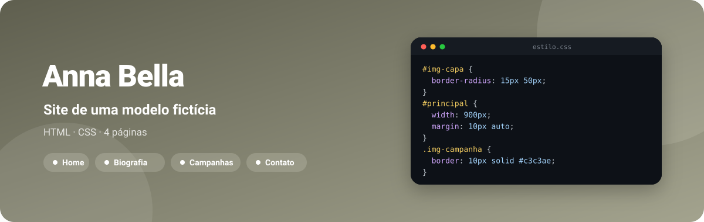
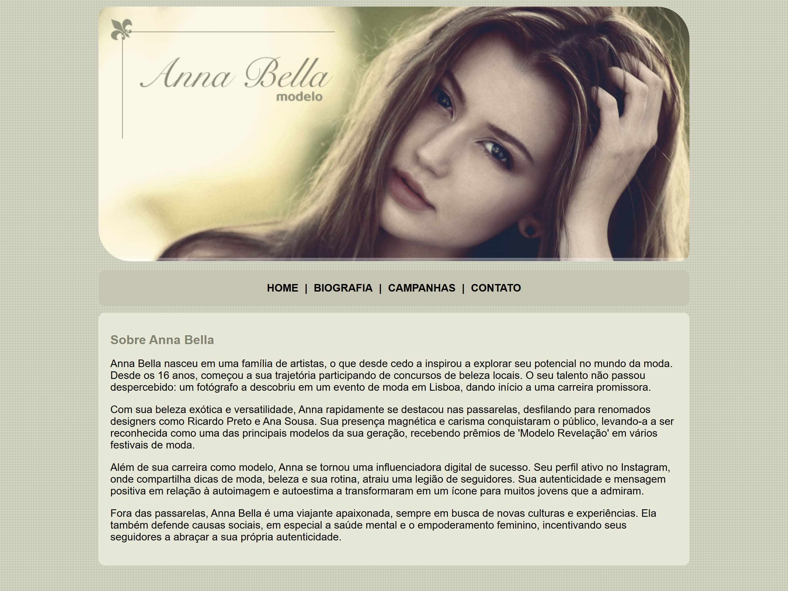
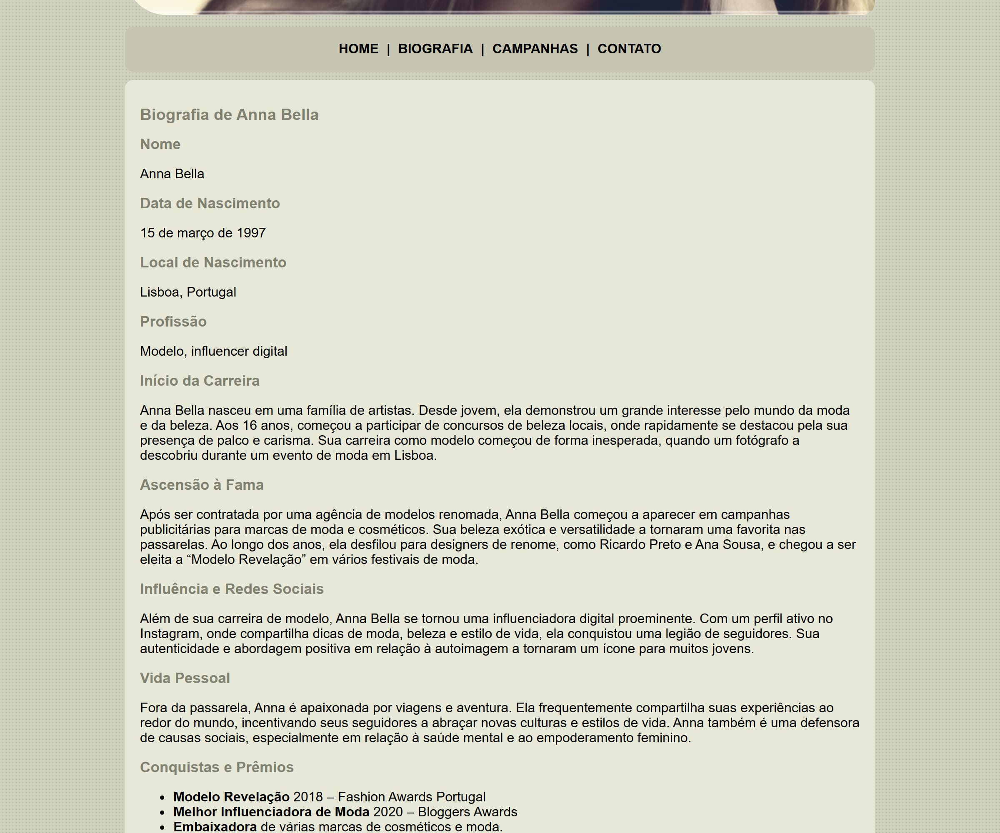
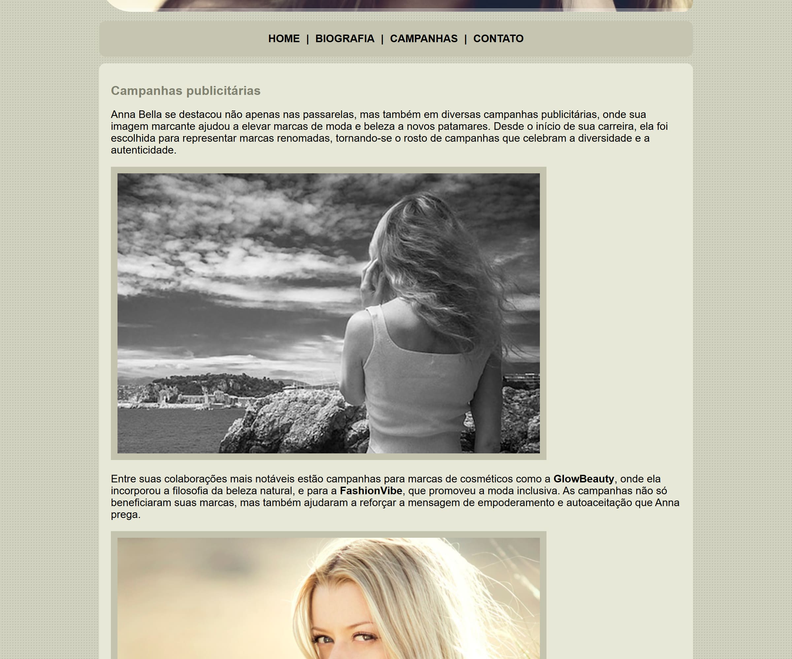

<div align="center">



**Site de quatro páginas para a modelo fictícia Anna Bella — home, biografia, campanhas e contato —, em HTML e CSS puros.**

[](LICENSE)
[](https://github.com/kessleru/AnnaBella-Web/commits/main)
[](https://github.com/kessleru/AnnaBella-Web)



</div>

## Sobre

Um dos primeiros projetos de HTML e CSS: um site institucional com quatro páginas ligadas por um
menu comum. A personagem, os textos e as marcas citadas são fictícios.

Todas as páginas compartilham a mesma estrutura — capa, menu, conteúdo e rodapé dentro de um
`#principal` de 900px centralizado — e um único `estilo.css` com pouco mais de cinquenta linhas. A
capa usa `border-radius: 15px 50px` para ter cantos diferentes na diagonal, e as fotos das campanhas
ganham uma moldura com `border` na cor da paleta.

## Telas

<table>
<tr>
<td width="50%"></td>
<td width="50%"></td>
</tr>
<tr>
<td align="center"><sub><b>Biografia</b></sub></td>
<td align="center"><sub><b>Campanhas</b></sub></td>
</tr>
</table>

## Páginas

| Página | Conteúdo |
|---|---|
| [`index.html`](index.html) | Apresentação: "Sobre Anna Bella" |
| [`biografia.html`](biografia.html) | Ficha com nome, nascimento, profissão, início da carreira e ascensão |
| [`campanhas.html`](campanhas.html) | Texto sobre as campanhas e três fotos emolduradas |
| [`contato.html`](contato.html) | E-mail e telefone (fictícios) |

## Stack

| Camada | Ferramenta |
|---|---|
| Marcação | HTML5 |
| Estilo | CSS3 — `border-radius`, fundo com textura, largura fixa |

> **Nota:** o layout tem largura fixa de 900px e não usa media queries, então não se adapta a
> telas de celular.

## Rodando localmente

```bash
git clone https://github.com/kessleru/AnnaBella-Web.git
cd AnnaBella-Web
python -m http.server 8000
```

Abra `http://localhost:8000`. Não há dependências nem build — abrir o `index.html` direto no
navegador também funciona.

## Estrutura

```
├── index.html · biografia.html · campanhas.html · contato.html
├── estilo.css      # compartilhado pelas quatro páginas
└── imagens/
    ├── capa.png    # topo de todas as páginas
    ├── foto1-3.png # fotos das campanhas
    └── fundo.png   # textura do fundo
```

<details>
<summary><b>Regerando as imagens deste README</b></summary>

```bash
node .github/readme/gerar.mjs                 # banner.svg

python -m http.server 8000                    # em outro terminal
npm i --no-save puppeteer-core sharp
node .github/readme/capturar.mjs              # home, biografia e campanhas em 2x
```

</details>

---

<div align="center">
<sub>Feito por <a href="https://github.com/kessleru">Otávio Kessler Ustra</a> · <a href="LICENSE">MIT</a></sub>
</div>
